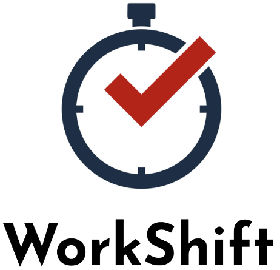

 

  
  
  
  

    For Students who suffer from poor Time Management, WorkShift is  the solution to staying ahead in tasks and creating time for yourself.  Unlike other time management applications, WorkShift is better in a Student Market as it is paired with the University Platform. 
     
  

<!-- TABLE OF CONTENTS -->

  
Table of Contents

  <ol>
    <li>
      <a href="#project-description">Project Description</a>
      <ul>
        <li><a href="#built-with">Built With</a></li>
      </ul>
    </li>
    <li>
      <a href="#installation">Installation</a>
      <ul>
        <li><a href="#installation">Installation</a></li>
        <li><a href="#usage">Usage</a></li>
      </ul>
    </li>
    <li><a href="#credit">Credit</a></li>
  </ol>

<!-- PROJECT DESCRIPTION -->
## Project Description

We are creating a platform that allows students to visualize the work they need to do for college and allow them to make time for leisure activities. Our app works with most college platforms (moodle, blackboard, google classroom, etc.) and recognizes due dates for homework, projects, discussions. Even more, our app works together with your calendar to plan for the best times, where you can work on whatever is due. Which, in its way, allows you to plan when it’s best to take advantage of free time. We intend to bring back what college experience used to be without asking colleges to change their academic plans; instead, the app will adapt to every college, so it is global. 

### Built With

This project was built suing:
* [Pycharm](https://www.jetbrains.com/pycharm/)

<!-- INSTALATION AND USAGE -->
## Installation and Usage

### Instalation
1. Download or Clone the repository to your computer

2. Open 'Logo_WorkShift.png', 'WorkShift_app.py', and 'graphics.py'
3. Load them into PyCharm

4. Run 'graphics.py'

5. Run 'WorkShift_app.py'

### Usage
1. To login, enter with your IE University email

2. Add an event by click on the "Add Event" button

3. Enter the name, date, start time, and end time of your event

4. Check your calendar for your event

5. Add more events

<!-- CONTACT -->
## Credit

José Manuel Canales - jcanales.ieu2019@student.ie.edu
Omar-Amine Farih - ofarih.ieu2019@student.ie.edu
Pedro Rodriguez - jrodriguezp.ieu2019@student.ie.edu
Felipe Espinosa - fespinosa.ieu2019@student.ie.edu
Gonçalo Melo - gmelo.ieu2019@student.ie.edu
PROJECT LINK: [https://github.com/josemcanales/Github](https://github.com/josemcanales/Github)

